# WaterNet23 - Autonomous Water Vehicles
Repository for WaterNet23 Code and Schematics


## Background

This project was started as part of the one-year NC State ECE Senior Design class in January 2022. The goal of this project was to develop a series of low-cost autonomous water surface vehicles which could collect water quality measurements of aquaculture ponds. This README contains information on how to set up the water vehicles for operation and details on the hardware and software used for the project.

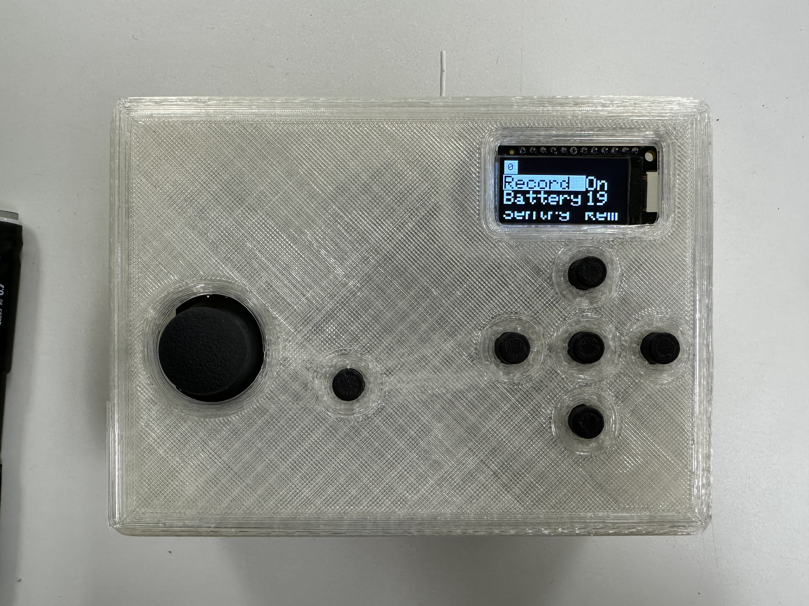 

This project has two parts - the water vehicles and the Central Control Hub (CCHub). The CCHub communicates wirelessly with the vehicles using XBee (900MHz), Cellular (LTE) and Bluetooth Low Energy (BLE) with support for up to 10 vehicles. The water vehicles report telemetry back to the CCHub, which is then displayed on the CCHub's screen. The vehicles have three operation modes for movement: remote control, sentry and autonomous. Remote control allows for control using the CCHub joystick. Sentry mode captures the current GPS location and attempts to keep the vehicle within a set radius of that point. Autonomous mode allows for navigation to GPS waypoints which are fed into the CCHub over Serial from a companion computer. See the [Operating the Water Vehicles](#operating-the-water-vehicles) section for more information on how these functions work.

## Table of Contents
 - **[Features](#features)**: Hardware/software capabilities of the vehicles and CCHub.
 - **[Operating the Water Vehicles](#operating-the-water-vehicles)**: How to use the CCHub to control the water vehicles.
 - **[Hardware](#hardware)**: Information about the hardware components used on the CCHub and vehicles.
 - **[Software](#software)**: Information about the software communication and control systems.
 - **[Setting Up the Development Environment](#setting-up-the-development-environment)**: Information about hwo to install Visual Studio Code and upload code to the microcontrollers.
 - **[Software Architecture](#software-architecture)**: Information about common software practices used in the programming of the boards and quick links to get you started on understanding the microcontroller functions.

## Features
 - Network support for controlling up to 10 water vehicles
 - Autonomous navigation mode for movement to GPS waypoints
 - Sentry mode to maintain position for continuous measuring in one place
 - Graphical menu for configuring vehicles and observing status
 - Redundant communication via LTE, XBee and Bluetooth LE
 - Water quality sensing for temperature, dissolved oxygen, pH, and conductivity
 - Logging of water quality measurements on a micro-SD card
 - Wireless copying of water quality measurements from vehicles to CCHub micro-SD card
 - 80W solar panel for long-term stationary monitoring
 - Light tower for observing vehicle status from shoreline
 - Leak detection emergency shutoff


## Operating the Water Vehicles

This section has instructions for powering up the water vehicles and operating them using the Central Control Hub.

### Powering the CCHub and Water Vehicles

The CCHub has a micro USB port on its side which needs to be powered with a high-amperage (2.1A) USB brick or power bank. Once plugged in, the CCHub will automatically attempt to establish Cellular connection and receive messages from the water vehicles.

The water vehicles are powered from the a Lithium-ion battery pack and have a button for powering up the board. There is a latching mechanism on the main board which will keep the power on once the microcontroller has started operating. Hold the power button for five seconds to ensure the power latch is enabled. Like the CCHub, the water vehicles will attempt to establish a Cellular connection and will broadcast periodic messages for the CCHub to pick up.

Once a vehicle has connected to cellular and the CCHub has received the message, it will show up on the CCHub screen as a block with its identifier ID. See the next section for how to navigate the menu on the CCHub.

### Menu Navigation

The CCHub menu is navigated using the integrated DPAD buttons. When not modifying a setting, the left/right buttons switch which vehicle is being controlled, and the up/down arrows navigate which item is being selected. To modify one of the settings, press the enter button and it will highlight the value to be changed. Use the left/right buttons to modify the value and press enter to confirm. There is also an emergency stop toggle next to the joystick which will stop motion of all vehicles.

#### Settings
- **Record**: Enables/Disables logging of water quality measurements to the SD card (on/off)
- **Battery**: Estimated battery percentage of the water vehicle's battery (not editable)
- **Sentry**: The current [Driving Mode](#driving-modes) of this water vehicle (Rem/Sen/Aut)
- **Signal**: Turning on signal causes the light tower of this vehicle to flash amber (on/off)
- **SolPwr**: Shows how many watts the solar panel is generating (not editable)
- **BatPwr**: Shows how many watts are being drawn from the Lithium-ion battery (not editable)
- **Offload**: Starts a copy of all files from the vehicles microSD card to the CCHub microSD card over Bluetooth. Only enable when vehicles are docked! (on/off)

### Driving Modes

#### Remote Control (Rem)

Remote control mode allows the user to use the joystick on the CCHub to control the direction and speed of the vehicle manually like an RC car. In remote mode, the joystick controls whichever vehicle is currently selected on the menu.

#### Sentry (Sen)

Changing the control mode to Sentry mode will send a target latitude and longitude waypoint to the vehicle and have the vehicle navigate to that point. After it reaches that point, it will use the GPS and compass to navigate back to that target point if it goes farther than a set radius (current software is set to 4 meters). This mode can be used to take samples of one part of a water body over a large period of time, as it will correct for water currents pushing the vehicle.

#### Autonomous (Aut)

Changing the control mode to Sentry mode will send a target latitude and longitude waypoint to the vehicle and have the vehicle navigate to that point. These GPS waypoints are fed into the CCHub via the USB port which is connected to companion computer. See the next section for information about the companion computer.

### Companion Computer and Waypoints

See the [Companion Computer to CCHub Command Structure](#companion-computer-to-cchub-command-structure) section for how to send the GPS waypoints to the CCHub.

### Light Tower Statuses

The water vehicles are equipped with a small light tower that has an RGB LED. The LED will change colors/blinking patterns depending on which mode it is in and which communication protocols are available.

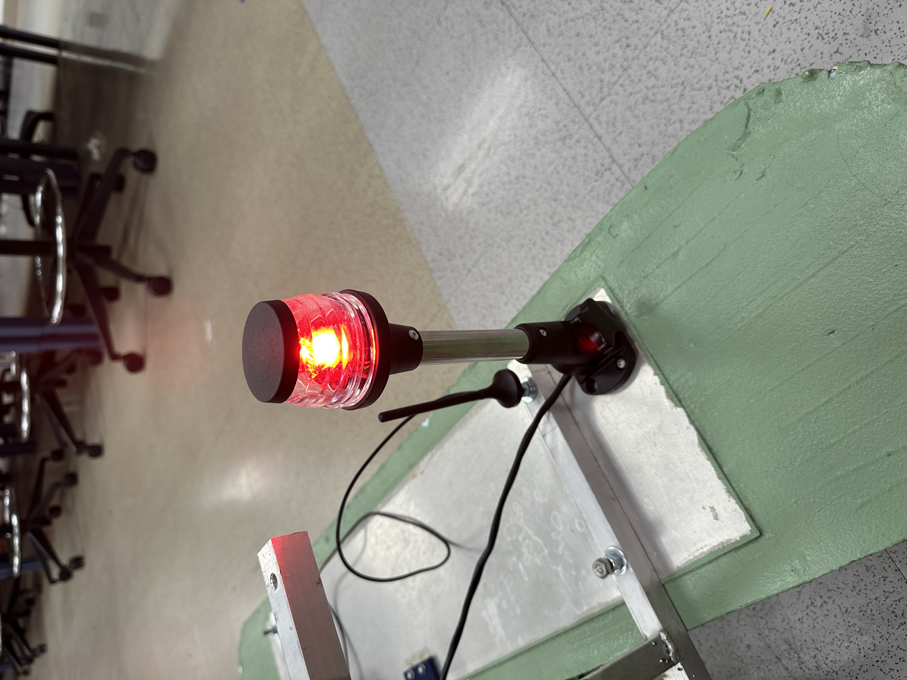

#### Color Schemes
Color     | Description
----------|------------------------------------------
CYAN      | All modes of communication are available
YELLOW    | XBee and BLE are available
WHITE     | LTE and BLE are available
BLUE      | Only BLE available
GREEN     | XBee and LTE available (typical when out in water)
ORANGE    | Only Xbee available
MAGENTA   | Only LTE is available (recovery mode)
RED       | No communication available

#### Blinking Patterns
Pattern            | Description
-------------------|---------------------------
Blinking (normal)  | Battery is low
Blinking (slow)    | Sentry Mode
Fading             | Autonomous Mode
Solid              | Manual Mode

#### Special Modes
Pattern               | Description
----------------------|----------------------------------
Fast Blinking Blue    | Copying micro-SD data to CCHub
Fast Blinking Amber   | Signaling response from CCHub


### Water Quality Sensors
The water vehicles are equipeed with a series of water quality sensors which connect to five SMA connectors on the side of the enclosure. Ensure the sensors are color-matched to the daughter boards on the vehicle PCB. See the [Atlas Scientific Water Quality Sensors](#atlas-scientific-water-quality-sensors) section for how these sensors work and how to configure them on new vehicles.

### Micro-SD Card Logging
Each of the water vehicles have an onboard Micro-SD card reader (on underside of PCB) which is used to store the water quality measurement in a CSV file. This file can be opened in Excel or other sheet processing programs for data analysis of the collected measurements. Below are a few sample measurements on a bench for the temperature and pH probes.

Time           | Latitude | Longitude | Temperature | pH       | Dissolved O2 | Conductivity 0.1K | Conductivity 1K
---------------|----------|-----------|-------------|----------|--------------|-------------------|-----------------
08132022201055 | 0.000000 | 0.000000  | 32.425999   | 3.623000 | 0.000000     | 0.000000          | 0.000000
08132022201057 | 0.000000 | 0.000000  | 32.437000   | 3.616000 | 0.000000     | 0.000000          | 0.000000
08132022201100 | 0.000000 | 0.000000  | 32.438999   | 3.604000 | 0.000000     | 0.000000          | 0.000000
08132022201102 | 0.000000 | 0.000000  | 32.443001   | 3.614000 | 0.000000     | 0.000000          | 0.000000


## Hardware

### Water Vehicle PCB


### Water Vehicle Block Diagram

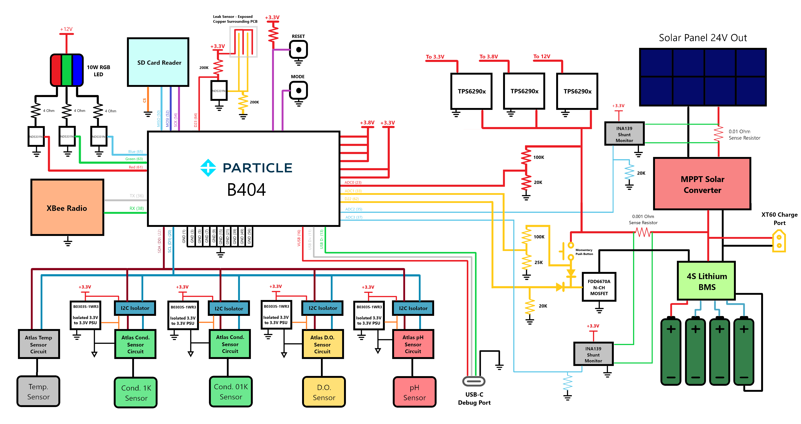

### Particle B402/B404X Microcontroller


For controlling all of the hardware on both the vehicles and CCHub, we used the Particle B-Series System-on-a-Module (BSoM). We chose the BSoMs for their integrated Cellular and Bluetooth Low-Energy communication capability and relatively low cost (~$55/module). These microcontrollers have fairly generous IO and memory capability and are easy to program in C++ using their Particle DeviceOS hardware abstraction layer (HAL). Particle also includes 100MB/month of cellular data in their free plan, which would be plenty for using LTE as a fallback communication mechanism. See the [Software Architecture](#software-architecture) section for more details on how to set up the environment for developing and uploading the firmware on the BSoM.

### Atlas Scientific Water Quality Sensors

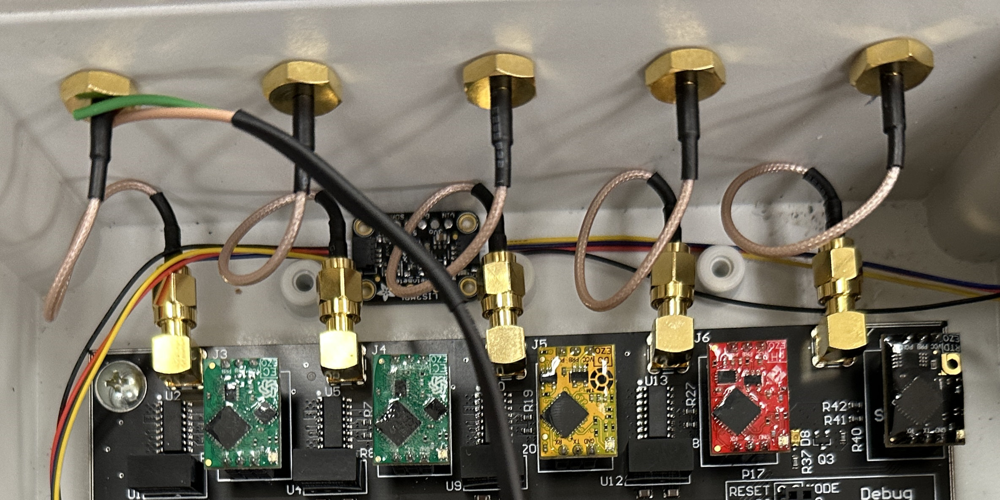 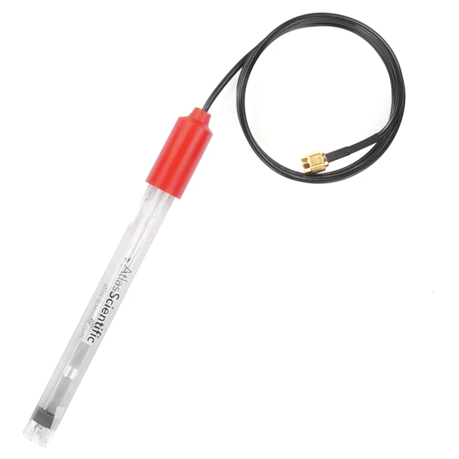

The water vehicles have a series of [Atlas Scientific](https://atlas-scientific.com/) water quality sensors. The sensor probes connect using a set of SMA connectors which mount to the exterior of the main PCB enclosure. Ensure the sensors are connected to the SMA connector that matches the circuit (red pH probe goes to the connector in front of the red EZO module). Currently, the vehicle is equipped with the following sensors:

- [Temperature](https://atlas-scientific.com/probes/standard-temp-probe/)
- [pH](https://atlas-scientific.com/probes/consumer-grade-ph-probe/)
- [Dissolved Oxygen](https://atlas-scientific.com/probes/dissolved-oxygen-probe/)
- [Conductivity K 0.1](https://atlas-scientific.com/kits/conductivity-k-0-1-kit/)
- [Conductivity K 1.0](https://atlas-scientific.com/kits/mini-conductivity-k-1-0-kit/)

These sensors use their standard [EZO](https://atlas-scientific.com/embedded-solutions/ezo-ph-circuit/) interface which communicates over I2C to the BSoM microcontroller. Since the interface is standard, the modules/sensors can be swapped out for others that Atlas sells such as the [Oxygen reduction potential](https://atlas-scientific.com/orp) sensor with some slight code modifications.

#### Important Note
The sensors need to be configured to operate in I2C mode with a particular address. By default, they operate in UART mode. See the [pH EZO datasheet](https://files.atlas-scientific.com/pH_EZO_Datasheet.pdf) for the commands needed to switch to I2C mode. You can communicate over UART using a simple USB COM Port adapter (such as FT232RL) or using an Analog Discovery 2. In the software, there are macros which set the I2C address used by each sensor:

```cpp
#define PHADDR              99              //default I2C ID number for EZO pH Circuit.
#define MCOND               100             //default I2C ID number for EZO Mini-Conductivity (0.1)
#define COND                101             //default I2C ID number for EZO Conductivity Circuit. (1.0)
#define TEMPADDR            102             //Default I2C address for temperature sensor
#define DOADDR              97              //Default I2C address for Dissolved Oxygen sensor
```

The I2C system also has a set of I2C isolator circuits which are necessary to prevent interference between the sensors when they make contact with water. Without the isolators, the sensors will feed back into each other and cause inaccurate readings. All EZO circuits, except the temperature probe, have the I2C isolation. The isolation is done using a 3.3V to 3.3V isolated power supply and a I2C isolator IC.


### XBee Radio

In addition to Cellular and BLE, we included a XBee S3B wireless module on the vehicles and CCHub. These modules offer greater range (up to 9 miles!) at similar latency to BLE. The XBee modules we chose operate in the 900MHz range (the same as LoRa), and offer an easy-to-use mesh based communication between all modules in the network. These modules essentially act as a wireless UART console between all nodes in the network, and our command structure handles negotiation of the destination node. Below is an example of communication with XBee between two microcontrollers:

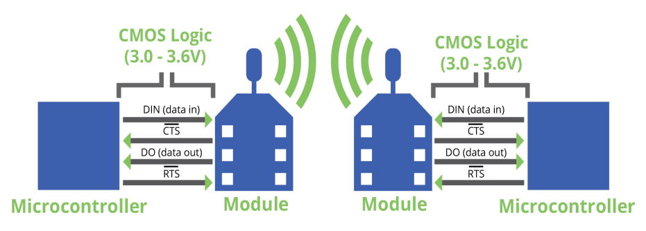

**Important Note**: The XBee modules require network setup to become part of a mesh network. Check out this [Instructables setup guide](https://www.instructables.com/How-to-Use-XBee-Modules-As-Transmitter-Receiver-Ar/) for configuring them. For setting up new vehicles, connect the XBee from the CCHub to XCTU and get the channel number. For more information about the XBee S3B Modules, check out the [Datasheet](https://docs.digi.com/resources/documentation/digidocs/pdfs/90002173.pdf).


### Neo-M8U GPS

For autonomous navigation, we decided to use the [Neo-M8U GPS](https://www.sparkfun.com/sparkfun-gps-dead-reckoning-breakout-neo-m8u-qwiic.html) for its accuracy at low cost. This module also has the convenience of the [QWIIC](https://www.sparkfun.com/qwiic) interface for powering and communicating with it. 

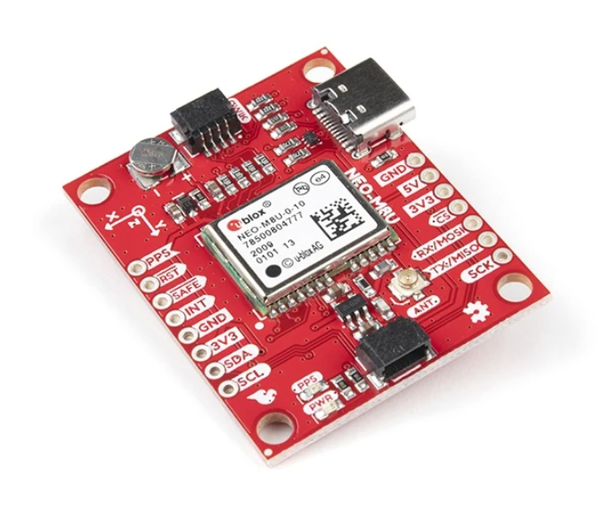

We initially wanted to use its untethered dead reckoning (UDR) feature to enable better accuracy and make use of its internal IMU for getting the water vehicle's heading and speed, however getting this feature proved difficult for our timeline. The UDR feature unfortunately requires some calibration at higher speeds than our water vehicle supports, so we only ended up using it for it's GPS position data. Interfacing with the GPS module was done using the [SparkFun Ublox Arduino Library](https://github.com/sparkfun/SparkFun_Ublox_Arduino_Library).


### LIS3MDL Compass

With the untethered dead reckoning feature not working, the Neo-M8U GPS was not able to provide a heading, we decided to add a [LIS3MDL compass](https://www.adafruit.com/product/4479) as a substitute. At this point, we had about a month remaining in the project and had to find a quick solution. The compass conveniently used the QWIIC interface so it was easy to install.

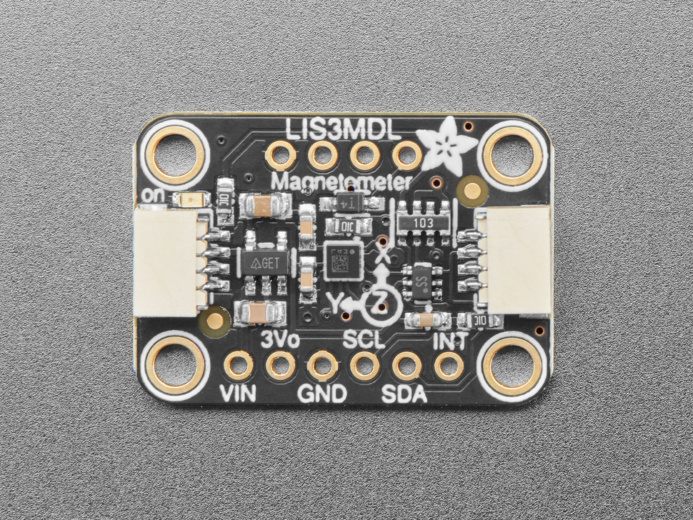

On the lab bench, this compass proved to do the trick, but we quickly realized (with no time left in the project) that any tilt of the module (a frequent occurrence on water!) will wildly throw off the readings. This bad reading caused our autonomous movement algorithm to perform circles. To overcome this, we could use a tilt-compensated module such as the GY-511 which has an accelerometer.


### Motor Drive System

For a movement system, we wanted to upgrade the basic paddle-style rotors to some off-shelf turbine-style motors for their improved efficiency and higher speed capability. We paired the brushless motor turbines with some off-shelf Electronic Speed Controllers (ESCs), which take a simple [duty-cycle baset 50Hz PWM signal](https://howtomechatronics.com/tutorials/arduino/arduino-brushless-motor-control-tutorial-esc-bldc/) for control. These motors got mounted on the inside of both styrofoam blocks and allow for tank-style movement.

 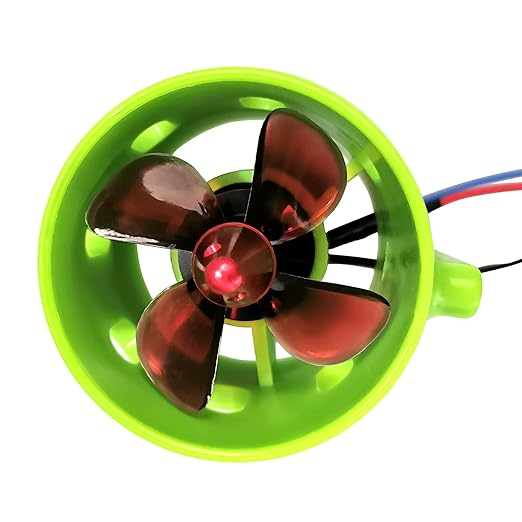


### Light Tower LED Driver

The vehicle PCB has an LED driver for a common-anode 12V RGB LED. This LED is wired through a light tower to the four pin connector on the PCB. Below is an example of the RGB LED that can be used for the light tower.

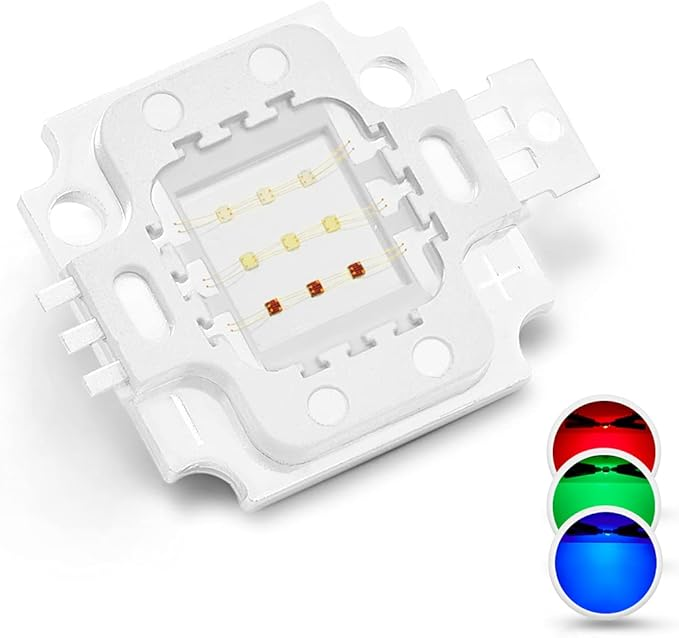


### Water Vehicle Power System

One of the intentions of these water vehicles was to have them  monitor one place on an aquaculture pond for many days on end. To achieve this, we both needed a large battery and a solar charging system. The battery was constructed out of [21700 Lithium-ion](https://liionwholesale.com/collections/batteries/products/lishen-21700-lr2170sd-9-6a-flat-top-5000mah-battery-genuine) cells and had a 4-series (14.8V nominal), 6-parallel configuration which gave it a capacity of ~450 watt-hours. The battery was constructed using a spot welder and had an off-shelf 4S BMS.

We also equipped it with a 80W solar panel to have the battery recharge during the day.


For solar charging, we purchased a Maximum-power-point-tracker PCB for handling battery charging from the solar panel. This PCB regulates the amount of power being drawn from the solar panel to ensure the maximum wattage is generated for the given lighting conditions.

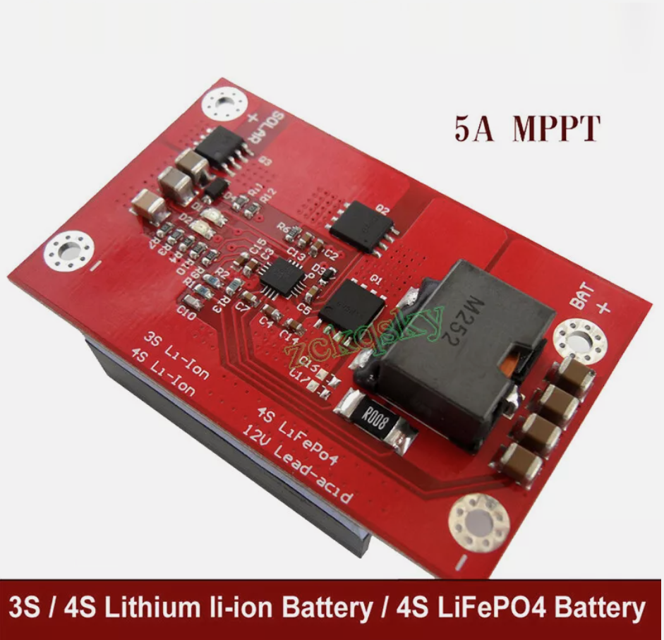

Integrated in the water vehicle PCB are two XT-30 power ports, one for solar and one for the battery. These ports also have a [Shunt Monitor](https://learn.sparkfun.com/tutorials/ina169-breakout-board-hookup-guide/all) for measuring the amount of power being drawn by each of the two power sources.

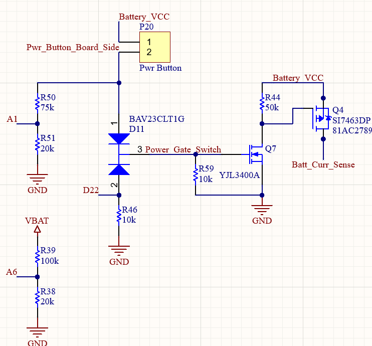

The power system also has a special latch mechanism for powering up and maintaining power on the vehicle PCB. The latch is first enabled by the user holding down the power button, and is then held on by the BSoM until it is ready to be turned off. There is a leak-detection trace that runs around the outside of the vehicle PCB which sends a singal to the BSoM when water is detected. The BSoM can then turn off the latch as an emergency shutoff to prevent corrosion due to water damage.


### Central Control Hub Dev Board

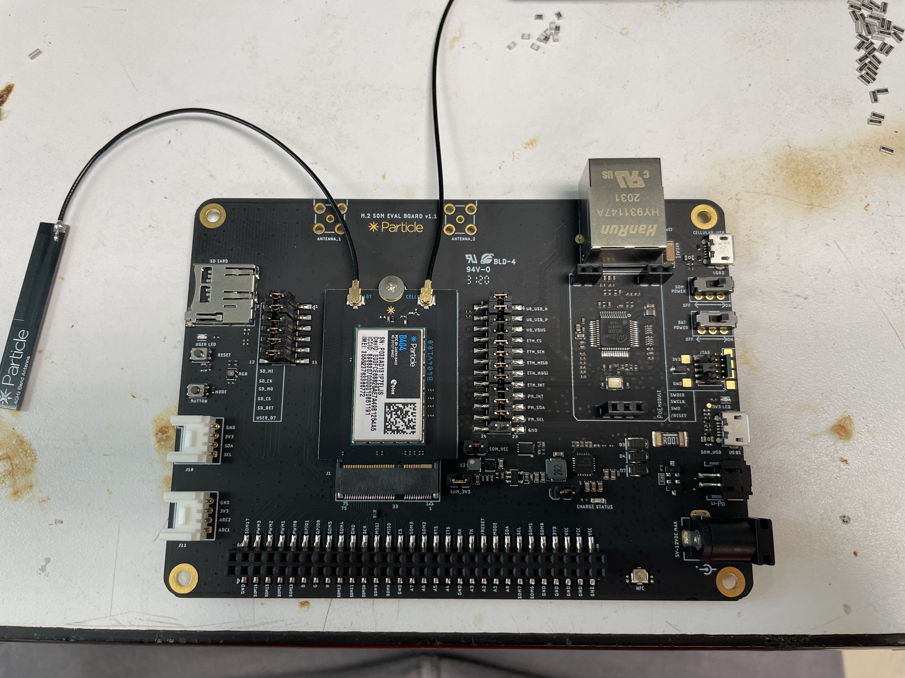


### Central Control Hub Block Diagram

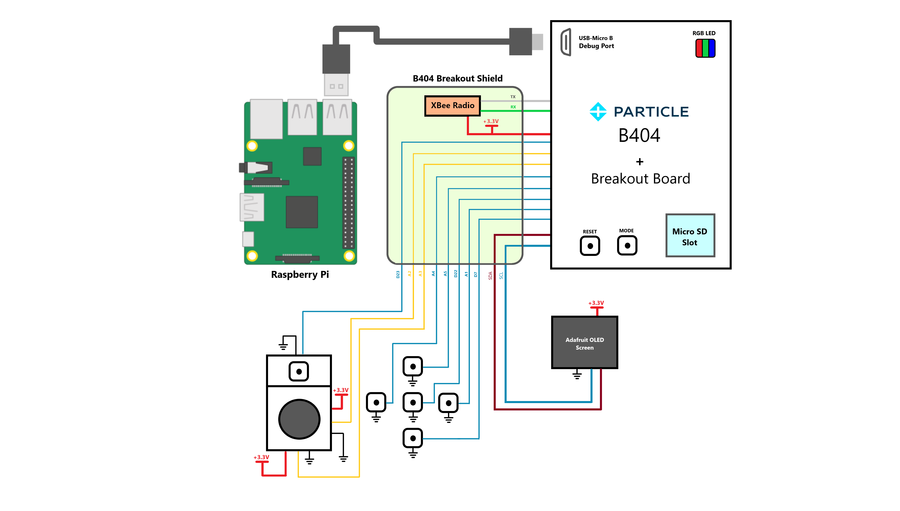

This block diagram shows the button configuration of the CCHub's daughter board. The daughter board acts like a Raspberry Pi's Hat and connects to the multi-pin header on the BSoM dev board.


### Central Control Hub Screen

To display the user interface on the CCHub, we included a [SH1107-based OLED Screen](https://www.adafruit.com/product/4650) from Adafruit. It is 128x64 pixels and allows us to display three menu items at a time and the bot selection tabs. This attaches to the daughter board of the CCHub and communicates over I2C to the BSoM.


## Software

This section contains information about software components and configuration settings

### Water Vehicle Identifier

The water vehicle software has a macro which is used to uniquely identify each vehicle in the network. This macro is located at the top of the WaterNet23Vehicle.ino file and is called `BOTNUM`. Change this number to something between 0 and 9 and ensure these numbers are unique across the bots in your network or clashing of commands will occur.

**TODO**: Compile a unique identifier based on the serial number of the BSoM


### Redundant Communication System

The water vehicles are designed with three communication modes: Bluetooth Low-Energy, XBee, and Cellular. This was to allow for a balance of range, latency, and reliability between the vehicles and CCHub. The communication system uses the same command structure (see the [Command Structure](#cchub-to-vehicle-command-structure) section) across all modes of communication, but prioritizes communication in the following order: XBee, BLE, then Cellular.


### Basic Autonomous Navigation Algorithm

For autonomous movement, we set up a GPS waypoint system where the target latitude and longitude were relayed from the CCHub to the water vehicles. The vehicle would then calculate the target heading, relative to north, of its current latitude and longitude (X2). Then, using the compass heading, it would calculate the heading delta (X1 + X2), which would range from -180 to +180. This could then be mapped to the motor speeds on the left and right side. Positive values of heading delta would speed up the left motor and negative values would speed up the right motor. For the few tests where the compass calibration was accurate (see the [compass section](#lis3mdl-compass) for more details), this correctly had the vehicle turn around and head toward a point.

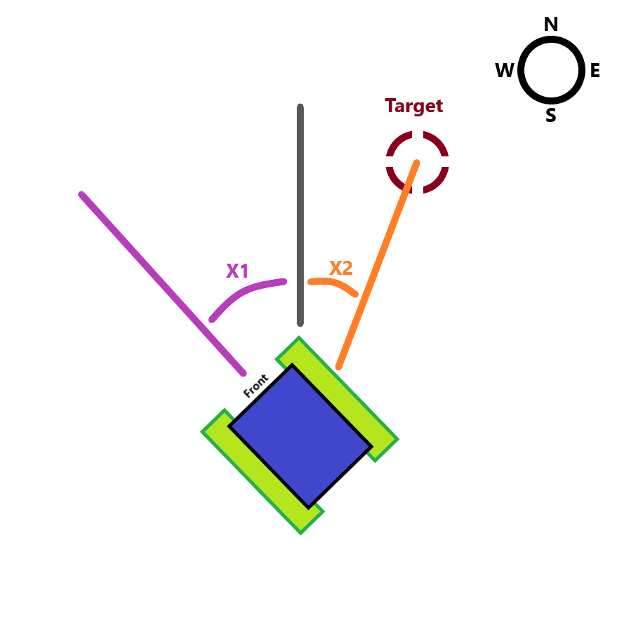


### CCHub to Vehicle Command Structure

This section has information about the commands exchanged between the CCHub and water vehicles. These commands are processed in the `processCommand()` function in the code and have the following structure:

```
XXYYCCCAAAAAAAAAAAAZZ (Max 255 bytes)

XX:  Source controller (CC = CCHub, Bx = Bot number x)
YY:  Target controller(s) (Bx = bot number x, AB = all bots)
AA+: Data payload associated with command
CCC: 3-byte command type
ZZ:  Checksum for the command string. Total number of bytes in the string.
```

#### Commands to Vehicle

- `ctl` -  Control Command

Main command for updating the state of the water vehicle. Takes a space-separated payload with the following information:
```
U V W X Y Z

U = Target Latitude (float)
V = Target Longitude (float)
W = Drive Mode (integer, 0 = manual, 1 = sentry, 2 = autonomous)
Y = Sensor Logging Enabled (0 = disabled, 1 = enabled)
Z = LED Signaling Enabled (0 = disabled, 1 = enabled)
```

- `mtr` -  Motor Speed Command

Takes a 3-character speed for each motor. 0 represents full speed in reverse, 180 represents full speed forward.
```
XXXYYY

XXX = Left Motor Speed (0-180)
YYY = Right Motor Speed (0-180)
```

- `req` - Data Request Command

Takes no arguments. Requests that the water vehicle send a sample of each water quality measurement back to the CCHub

- `pts` - Put-String Command

Debug command that takes any characters in the payload and writes them to the log file on the SD card and prints it out to the USB serial console.

- `spc` - Status Check Command

Takes no arguments. A simple message which allows the vehicle to determine if the CCHub has communication with it.

- `hwa` - Hello World Acknowledge Command

Takes no arguments. Hello World! This message is sent by the CCHub periodically while waiting for bots to be paired. The bots can have a flag set to prevent any actions on startup until this command is received.

- `dmp` - SD Card Dump Command

Takes no arguments. Causes the vehicle to enter [Offload Mode](#setting-up-the-development-environment) where all data from the microSD card is copied over Bluetooth LE to the CCHub. Depending on the size of the data, this can take a long time. Only execute this command when at shore as motor control is not active during this mode!


- `egp` - Emulated GPS Point Command

Updates the GPS point normally set by the Control Command for doing benchtop testing. Takes a space-separated payload with the following information:

```
U V

U = Target Latitude (float)
V = Target Longitude (float)
```

- `stp` -  Emergency Stop Command

Takes no arguments. Sets both motors to idle.

#### Responses from Vehicle

- `sup` - Status Update Command

Main command sent by the vehicle which updates the items in the CCHub menu. Takes a space-separated payload with the following information:
```
U V W X Y Z

U = Battery percentage (integer, 0-100%)
V = Status flags (16-bit integer bitmask)
W = Current latitude (float)
X = Current longitude (float)
Y = Battery power (integer, watts)
Z = Solar panel power (integer, watts)
```

- `sns` - Sensor Reading Command

Command with the most recent reading of all sensors on the water vehicle. Takes a space-separated payload with the following information:
```
T U V W X Y Z

T = Current latitude (float)
U = Current longitude (float)
V = Dissolved oxygen (integer, multiplied by 1000)
W = pH (integer, multiplied by 1000)
X = Conductivity (integer, multiplied by 1000)
Y = Mini Conductivity (integer, multiplied by 1000)
Z = Temperature (integer, multiplied by 1000) (integer, watts)
```

- `hwd` - Hello World Command

Takes no arguments. This is sent periodically by the water vehicle when it has not received any messages from the CCHub yet. The CCHub will reply to this message with the Hello World Acknowledge command.

- `pts` - Put-String Command

Debug command that takes any characters in the payload and writes them to the log file on the SD card and prints it out to the USB serial console.

- `ldt` - Leak Detected Shutoff Command

Takes no arguments. Signals that a leak has been detected on the main vehicle PCB and that the microcontroller has executed an emergency shutoff.

- `ldb` - Leak Detected Battery Shutoff Command

Takes no arguments. Signals that a leak has been detected in the battery enclosure and that the microcontroller has executed an emergency shutoff.

- `wld` - Leak Detected Warning Command

Takes no arguments. Signals that a leak has been detected on the main vehicle PCB. The microcontroller has not shut off the power.

- `wld` - Leak Detected Battery Warning Command

Takes no arguments. Signals that a leak has been detected in the battery enclosure . The microcontroller has not shut off the power.


### Companion Computer to CCHub Command Structure

This section has information about the commands exchanged between the CCHub and Raspberry Pi companion computer. These commands are processed in the `processRPiCommand()` function in the code and have the following structure:

```
XXYYCCCAAAAAAAAAAAAZZ (Max 255 bytes)

XX:  Source controller (RP = Raspberry Pi, CC = CCHub)
YY:  Target controller(s) (RP = Raspberry Pi, CC = CCHub)
AA+: Data payload associated with command
CCC: 3-byte command type
ZZ:  Checksum for the command string. Total number of bytes in the string.
```

#### Commands to CCHub

- `ctl` - Water Bot Control Command

Main command sent by the RPi which updates the items in the CCHub menu. Takes a space-separated payload with the following information:
```
T U V W X Y Z

T = The water vehicle ID this command is targeted at (integer)
U = Target latitude (float)
V = Target longitude (float)
W = Drive Mode (integer, 0 = manual, 1 = sentry, 2 = autonomous)
X = Offloading mode (integer, 0 = disabled, 1 = enabled)
Y = Sensor recording enabled (integer, 0 = disabled, 1 = enabled)
Z = Signaling mode enabled (integer, 0 = disabled, 1 = enabled)
```

Example: `RPCCctl1 35.764730 -78.680762 2 0 1 0`

Configures vehicle 1 to enter autonomous mode and move to GPS location 35.764730 -78.680762 with sensor recording enabled.

#### Responses from CCHub

- `sup` - Status Update Command

Main command sent by the CCHub to update the water vehicle status to the RPi.Takes a space-separated payload with the following information:
```
T U V W X Y Z

T = Water vehicle number
U = Water vehicle battery percentage
V = Current latitude (float)
W = Current longitude (float)
X = Status flags (16-bit integer bitmask)
Y = Battery power (integer, watts)
Z = Solar panel power (integer, watts)
```


## Setting Up the Development Environment 

This section will explain how to install Visual Studio Code and set up the Particle workbench for installing and creating firmware on the microcontrollers.

### Software Requirements
- [Visual Studio Code](https://code.visualstudio.com/): Main development environment for writing code and flashing firmware to devices.
- [Particle Workbench](https://marketplace.visualstudio.com/items?itemName=particle.particle-vscode-pack) extension for Visual Studio Code to support flashing of Particle devices.
- [Git for Windows](https://git-scm.com/downloads/win): Optional for interaction with Git repositories. Get this if you will be making changes to the software/hardware and need to track changes.
- [Tortoise Git](https://tortoisegit.org/download/): Optional graphical tool for performing repository actions. Get this if you will be making changes to the software/hardware and need to track changes.
- [Optional] Serial Console (I prefer the one in the [Arduino IDE](https://www.arduino.cc/en/software))

### Cloning a Repository

To get a copy of the code repository for one of the projects, you'll need to clone down the repo. I prefer to use TortoiseGit, but other Git interfaces will also work. Find a folder where you want to have the repo downloaded, right click, and choose ToritoiseGit -> Git Clone (Windows 11 may need to click "show more options").

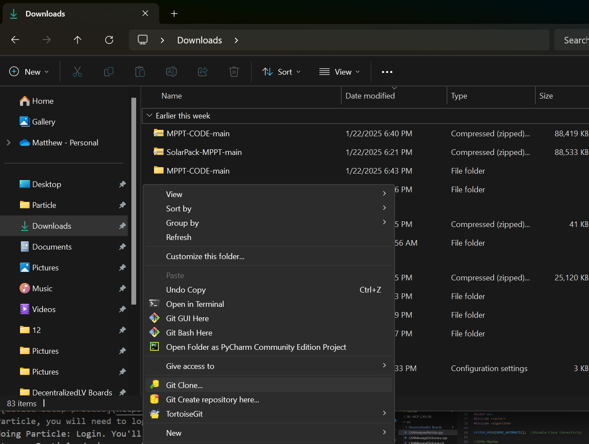

In the menu that pops up, you'll need to enter a source for where the repo is located. You can find this on GitHub by expanding the "Code" menu. If you are planning on making changes to the code, it is recommended that you make a new branch on GitHub such that the working code is maintained on the `master` or `main` branch.

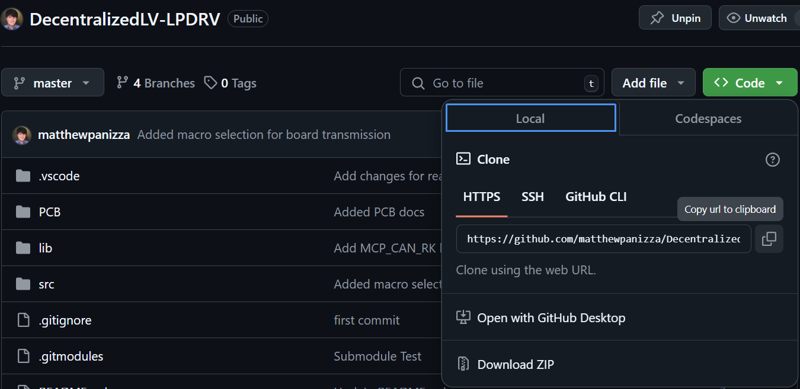

Once you've gotten a link and made a new branch, paste the link in the Tortoise menu and enter the branch you wish to clone down.

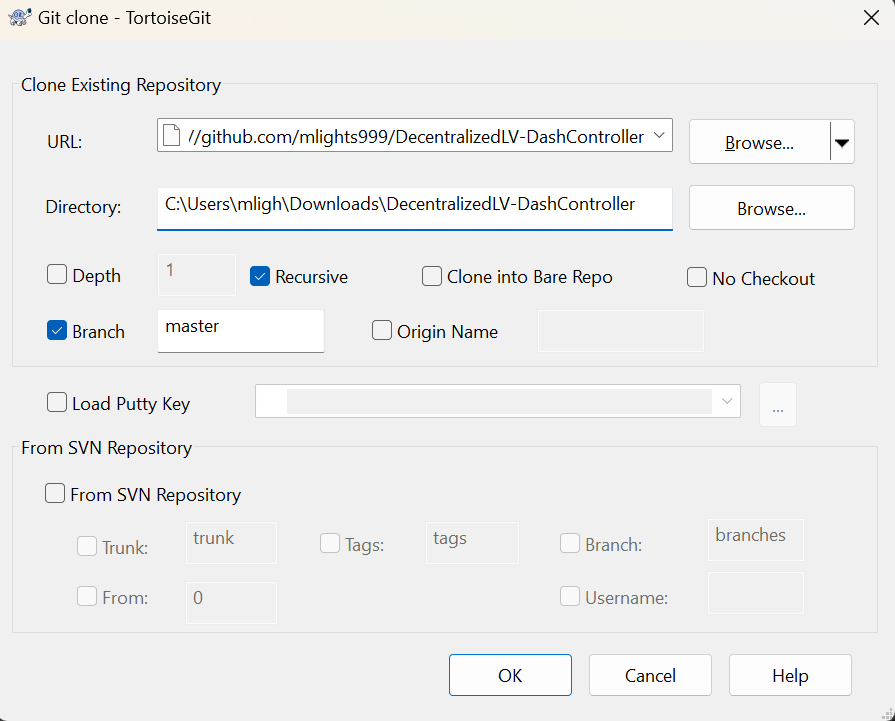

Press OK, and TortoiseGit should begin cloning down the repo. You may be asked to sign in to your browser on first setup.


### Opening Project and Flashing Firmware

After installing Visual Studio Code and the Particle Workbench Extension, you're now ready to install the firmware on the microcontroller. First, open up the cloned repository of the Particle project in Visual Studio Code by going to the Particle tab on the left toolbar and choosing Open Folder.

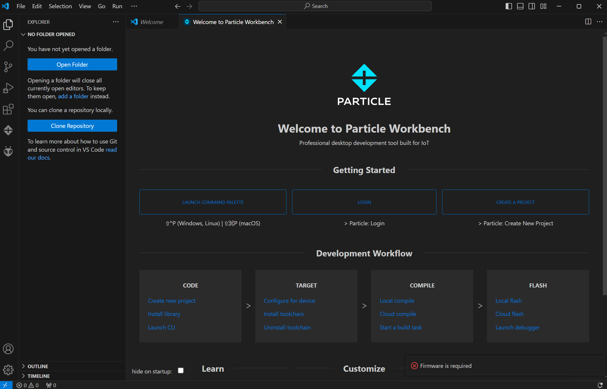

Choose the entire project folder from the cloned repo (don't just open the .cpp or the src folder).

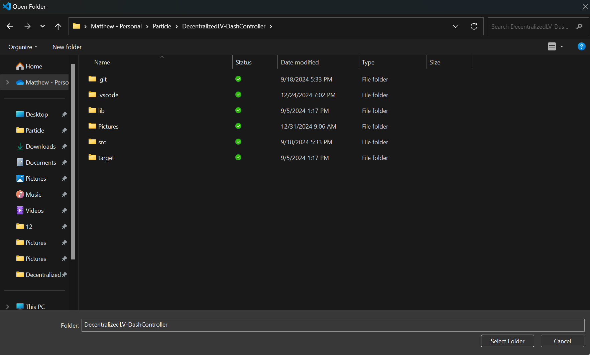

Once you've opened the folder, go to the Explorer tab on the left toolbar and expand the "src" folder. This folder will contain the source code for the program. Depending on how new your project is, there may be a .ino and a .cpp, or just a .cpp file. If there is a .ino file, open that by double clicking on it.

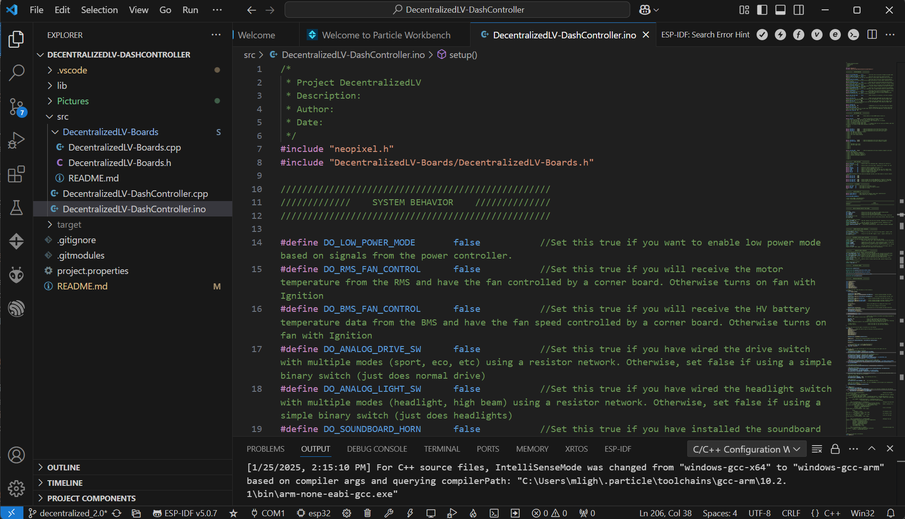

With the source file opened, some new options should appear in the top left corner of VS Code. These are used to compile and flash the application to the device. If these do not appear, you may have opened the incorrect folder.

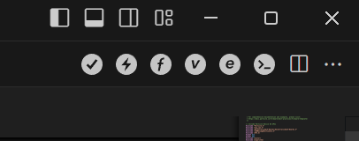

Before we can flash the application though, please make sure the options are set up correctly for your microcontroller. To choose a platform, go to the bottom toolbar of VS Code, and there is a platform selection. Change this to whichever microcontroller you are using (BSoM, Photon, Photon 2, Xenon, Argon, P2, etc.).

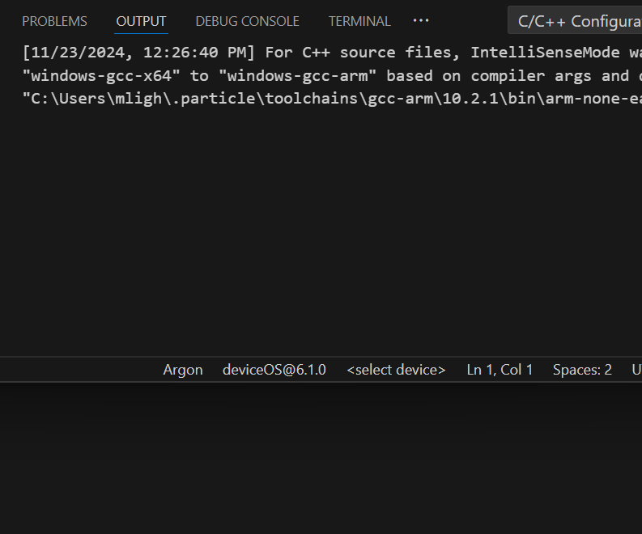

Next, connect your device using a USB cable to your computer. If you haven't registered the Particle device, its LED will be blinking blue. To set it up, follow Particle's [device setup process](https://setup.particle.io/). After registering with Particle, you will need to log in to Workbench by pressing Ctrl+Shift+P and doing Particle: Login. You'll need to log in for the flash tool to auto-detect your Particle device over USB, however there is a workaround. 

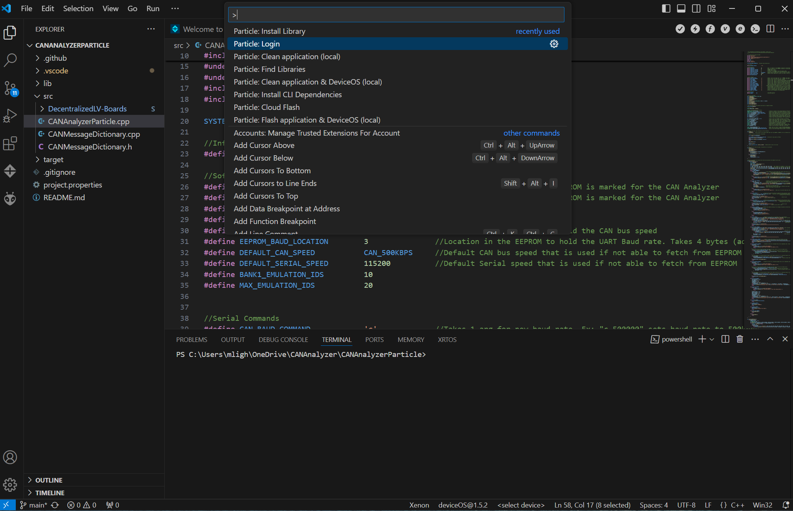

If your device has already had the Particle setup done on it, you can put it in DFU mode by pressing MODE and RESET, and then releasing RESET. Continue holding MODE until the LED is blinking yellow. From here you can flash the device. This is done by pressing the lightning bolt icon in the top right toolbar as previously shown. The output window will show the progress of the flash operation

**Important Note**: For the water vehicle code, ensure that you have [updated the bot number](#water-vehicle-identifier) before flashing! This is a unique ID used to identify the vehicle in the network

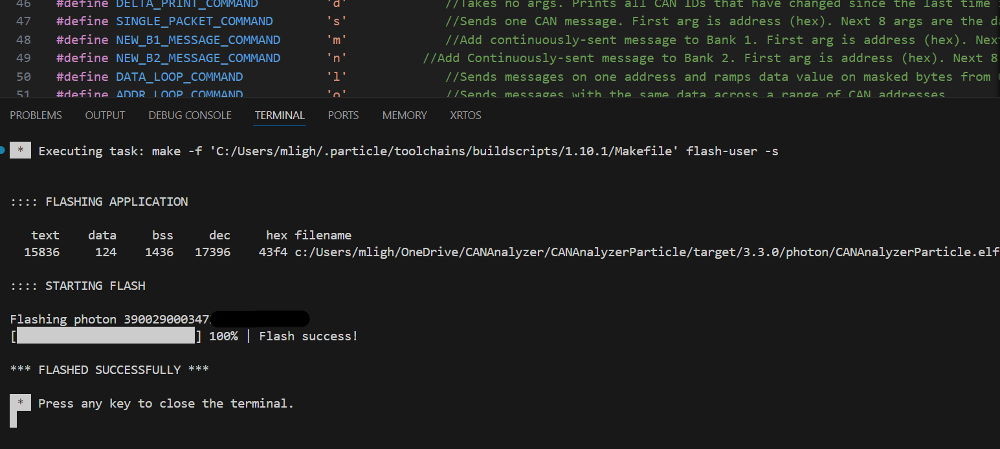

With the device flashed, you should now be running the new firmware.

### Installing Libraries

Most of the projects already have the MCP2515 and Neopixel libraries installed, but you may need to install others depending on your needs. To install a library, find the name of the library at [Particle's page](https://docs.particle.io/reference/device-os/libraries/search/). Then in VS Code, press Ctrl+Shift+P and find "Particle: Install Library". Enter the name and press enter. You must be logged into your Particle account (Ctrl+Shift+P Particle: Login) in VS Code to properly fetch the libraries! Libraries are installed under the `lib` folder.

## Software Architecture

### Microcontroller Datasheets

Check out the datasheets of each of the microcontrollers used on the boards in this system to better understand their capability and pinouts

- **[B402 Datasheet](https://docs.particle.io/reference/datasheets/b-series/b404-b402-datasheet/)**
- **[B404X Datasheet](https://docs.particle.io/reference/datasheets/b-series/b404x-datasheet/)**
- **[M.2 SoM Expansion Board](https://docs.particle.io/reference/datasheets/b-series/b-series-eval-board/)**

### Programming Reference Guide

This large programmer reference from Particle explains what each function in their software does and which pins those functions can be used on. 

**[Particle Device OS Reference](https://docs.particle.io/reference/device-os/firmware/)**

### Code Flow

Programs using Particle's DeviceOS follow the same setup used on Arduino, a `setup()` and `loop()` architecture. `setup()` is run once on startup, and then `loop()` continues executing forever as fast as it can. There can also be interrupts that pause this execution, jump to another function to execute some code, and then return to where it left off. These can be triggered by either a [Software Timer](https://docs.particle.io/reference/device-os/api/software-timers) or a [Pin Interrupt](https://docs.particle.io/reference/device-os/api/interrupts/interrupts).

**Caution**: The DecentralizedLV System can be controlling safety-critical operations. You need to ensure your code is responsive to messages coming in from the CAN Bus or is responding to switches from the driver.

To ensure that your code is responsive, you will need to be careful when adding any kind of delays in your program. It is not recommended to use `delay()`! This will cause what is known as blocking, where the controller sits idle and does not take inputs. Instead, you will want to use either [Software Timers](https://docs.particle.io/reference/device-os/api/software-timers), [Pin Interrupts](https://docs.particle.io/reference/device-os/api/interrupts/interrupts), or [millis()](https://docs.particle.io/reference/device-os/api/time/millis/) to schedule when operations should happen

Let's take an example of a program that we want to read a pin and change an LED to Green if the button is pressed. We also want the program to print a message once every second over the `Serial` console. Here's an example of why a `delay()` would cause problems:

```cpp
#define MYPIN_NUMBER    D0  //Microcontroller pin the voltage divider output is connected to
bool myPinSense;

void setup(){                         //Run once on startup
    pinMode(MYPIN_NUMBER, INPUT);     //Set GPIO to be an input
    RGB.control(true);                //Take control of the onboard RGB LED
    Serial.begin(9600);               //Start serial communication at 9600 baud
}

void loop(){                          //Continuously executes
    myPinSense = digitalRead(MYPIN_NUMBER);   //Read the state of the input signal
    if(myPinSense){             //If myPinSense is true, the button was pressed when digitalRead was called
        RGB.color(0, 255, 0);   //Takes R, G, B as arguments. This sets the LED to green
    }
    else{                       //If myPinSense is false, the button was released when digitalRead was called
        RGB.color(255, 255, 0); //Takes R, G, B as arguments. This sets the LED to green
    }
    delay(1000);    //Program sits for 1000 milliseconds
    //During this delay, NOTHING happens. The microcontroller is not reading the state of the pin.
    Serial.println("Print once per second!");   //Print out our message every one second
}
```

In this instance, if the button were only pressed for 250ms, the program may entirely miss it, as the button is only *sampled* every 1000ms due to the delay. This next example will utilize a `millis()` timing trick to trigger the print statement but have the button sampled much faster. `millis()` returns the number of milliseconds since the program started executing. This timing trick uses a variable to store a "snapshot" of the `millis()` clock and compare it against the current value of `millis()` to see how long it's been since the snapshot was taken.

```cpp
#define MYPIN_NUMBER    D0  //Microcontroller pin the voltage divider output is connected to
bool myPinSense;
uint32_t clockSnapshot = 0;

void setup(){                         //Run once on startup
    pinMode(MYPIN_NUMBER, INPUT);     //Set GPIO to be an input
    RGB.control(true);                //Take control of the onboard RGB LED
    Serial.begin(9600);               //Start serial communication at 9600 baud
}

void loop(){                          //Continuously executes
    myPinSense = digitalRead(MYPIN_NUMBER);   //Read the state of the input signal
    if(myPinSense){             //If myPinSense is true, the button was pressed when digitalRead was called
        RGB.color(0, 255, 0);   //Takes R, G, B as arguments. This sets the LED to green
    }
    else{                       //If myPinSense is false, the button was released when digitalRead was called
        RGB.color(255, 255, 0); //Takes R, G, B as arguments. This sets the LED to green
    }
    //NO delay!

    //Look at the difference between the snapshot and the actual clock
    // If the difference is > 1000, then 1000ms has elapsed.
    if(millis() - clockSnapshot > 1000){
        clockSnapshot = millis();                   //Take a NEW snapshot of the clock to reset the timer!
        Serial.println("Print once per second!");   //Print out our message every one second
    }
    //Now this loop() function executes thousands of times per second, making the button far more responsive!
}
```

This new mechanism is pretty simple to implement, and multiple snapshot variables can be created for timing different tasks. There is another implementation that can be done using a [Software Timer](https://docs.particle.io/reference/device-os/api/software-timers). The software timer will be set up to trigger every 1000ms and will set a boolean variable (called a "flag") to true, which will be read by the `loop()` function to check if 1000ms has elapsed.

```cpp
#define MYPIN_NUMBER    D0  //Microcontroller pin the voltage divider output is connected to
bool myPinSense;
bool timerDinged = false;

Timer myTimer(1000, timer_ding);      //Set up a timer and set its interval to 1000ms

void setup(){                         //Run once on startup
    pinMode(MYPIN_NUMBER, INPUT);     //Set GPIO to be an input
    RGB.control(true);                //Take control of the onboard RGB LED
    Serial.begin(9600);               //Start serial communication at 9600 baud
    myTimer.start();                  //Starts the timer. It will continuously execute until stop() is called
}

void loop(){                          //Continuously executes
    myPinSense = digitalRead(MYPIN_NUMBER);   //Read the state of the input signal
    if(myPinSense){             //If myPinSense is true, the button was pressed when digitalRead was called
        RGB.color(0, 255, 0);   //Takes R, G, B as arguments. This sets the LED to green
    }
    else{                       //If myPinSense is false, the button was released when digitalRead was called
        RGB.color(255, 255, 0); //Takes R, G, B as arguments. This sets the LED to green
    }
    //NO delay!

    if(timerDinged){            //Check if the timer function set the flag
        timerDinged = false;                        //Reset the flag until the timer sets it again
        Serial.println("Print once per second!");   //Print out our message every one second
    }
    //Now this loop() function executes thousands of times per second, making the button far more responsive!
}

void timer_ding(){
    timerDinged = true;
}
```

You can create multiple software timers in one program and have them set to different intervals for performing different tasks. In software timers, you can do other tricks, such as incrementing a variable, if you want to perform animations. One example would be to ramp up the value of a PWM output over time to fade an LED from off to on. Another good mechanism for reducing delay interference would be `attachInterrupt` which can be used to have a function trigger when a button is pressed. In this case, we will be changing the color of the LED in the function triggered by the button.

```cpp
#define MYPIN_NUMBER    D0  //Microcontroller pin the voltage divider output is connected to
bool myPinSense;
uint32_t clockSnapshot = 0;

void setup(){                                               //Run once on startup
    pinMode(MYPIN_NUMBER, INPUT);                           //Set GPIO to be an input
    RGB.control(true);                                      //Take control of the onboard RGB LED
    Serial.begin(9600);                                     //Start serial communication at 9600 baud
    attachInterrupt(MYPIN_NUMBER, pin_release, FALLING);    //call pin_release when the voltage falls
    attachInterrupt(MYPIN_NUMBER, pin_press, RISING);       //call pin_rising when the voltage rises
}

void loop(){                                                //Continuously executes
    //Look at the difference between the snapshot and the actual clock
    // If the difference is > 1000, then 1000ms has elapsed.
    if(millis() - clockSnapshot > 1000){
        clockSnapshot = millis();                           //Take a NEW snapshot of the clock to reset the timer!
        Serial.println("Print once per second!");           //Print out our message every one second
    }
    //Now this loop() function executes thousands of times per second, making the button far more responsive!
}

//function automatically called when pin is released
void pin_release(){
    RGB.color(255, 255, 0); //Takes R, G, B as arguments. This sets the LED to green
}

//function automatically called when pin is pressed
void pin_press(){
    RGB.color(0, 255, 0);   //Takes R, G, B as arguments. This sets the LED to green
}
```

### Some Noteworthy Functions from the Reference Guide

- [pinMode()](https://docs.particle.io/reference/device-os/api/input-output/pinmode) - configure pins as input or output
- [digitalWrite()](https://docs.particle.io/reference/device-os/api/input-output/digitalwrite) - set the output to 0V or 3.3V
- [digitalRead()](https://docs.particle.io/reference/device-os/api/input-output/digitalread) - Read if the input is 0V or 3.3V
- [analogRead()](https://docs.particle.io/reference/device-os/api/input-output/analogread-adc) - Read the voltage level of a pin between 0V and 3.3V as an integer between 0 and 4095
- [analogWrite()](https://docs.particle.io/reference/device-os/api/input-output/analogwrite-pwm) - Output a PWM signal. Takes one argument (0-255) to represent duty cycle
- [millis()](https://docs.particle.io/reference/device-os/api/time/) - Returns number of milliseconds since microcontroller started running. Use this for better timing compared to `delay()`!
- [attachInterrupt()](https://docs.particle.io/reference/device-os/api/interrupts/attachinterrupt) - Have a function automatically trigger when an input pin changes state
- [Timers](https://docs.particle.io/reference/device-os/api/software-timers) - Automatically trigger a function at a fixed interval
- [RGB](https://docs.particle.io/reference/device-os/api/led-signaling/) - Take control of the onboard RGB LED for easy onboard debugging
- [Serial](https://docs.particle.io/reference/device-os/api/serial) - Print out messages to a console for debugging with `Serial.printf()`
- [SPI](https://docs.particle.io/reference/device-os/api/spi) - Communicate with SPI peripherals like LCDs and the MCP2515
- [I2C](https://docs.particle.io/reference/device-os/api/wire-i2c) - Communicate with I2C sensors and peripherals
- [Cellular](https://docs.particle.io/reference/device-os/api/cellular) - Requires network setup. Allows for publishing data to the Particle Cloud or with Webhooks